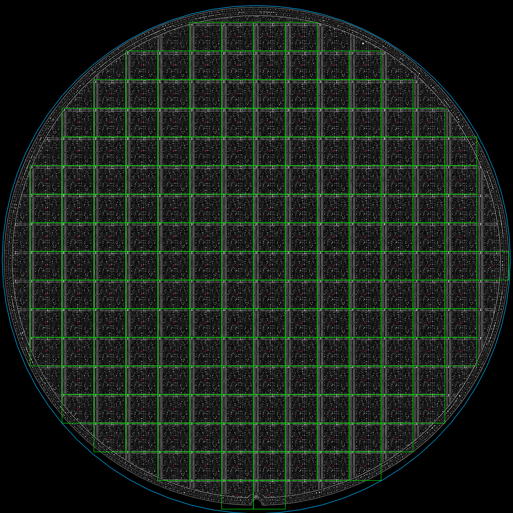
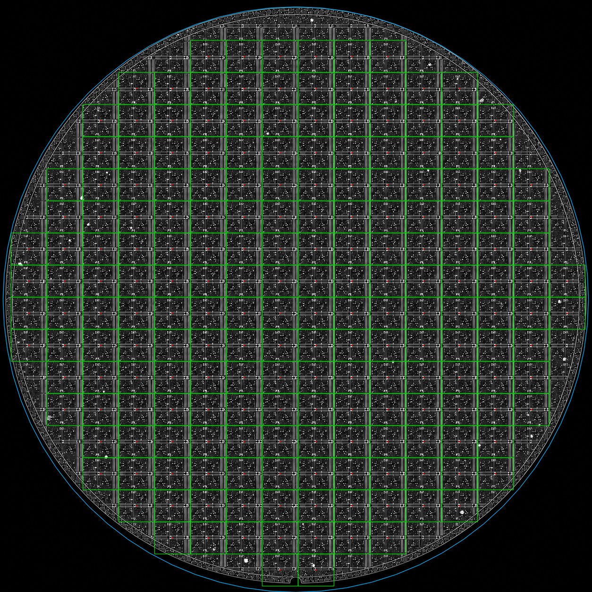
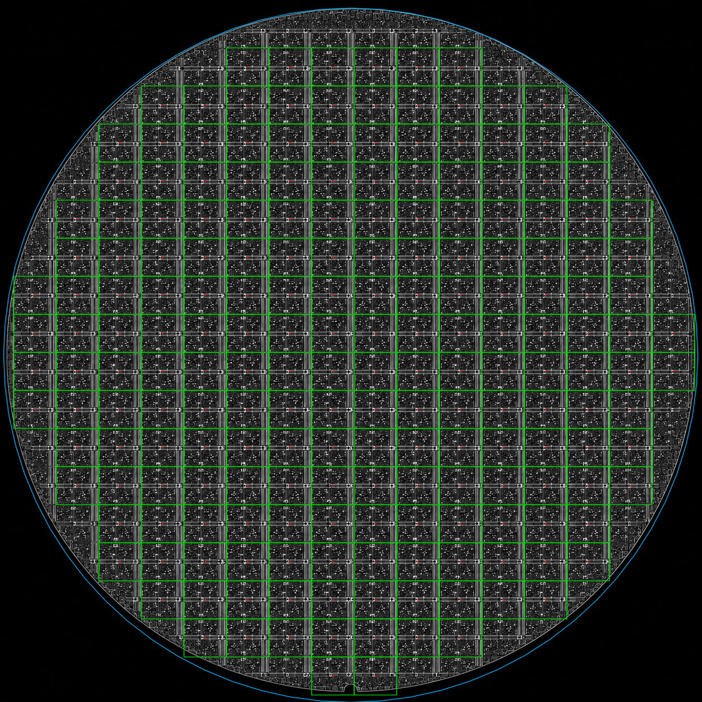

# Gray 전용 Die Map 검증

## 목적

`use_gray_wafer_die_particle.py`는 다른 파일을 import하지 않고 복사해서 사용할 수 있는 Gray 전용 판정 파일이다.

이번 수정은 실제 Gray wafer에서 다음 세 가지를 보장한다.

1. `build_die_map(image)`에 1채널 `uint8` 이미지를 바로 전달할 수 있다.
2. die 내부의 밝은 세로/가로 회로 패턴은 white street로 잘라내지 않는다.
3. wafer 원 밖을 조금이라도 걸치는 partial die는 결과 map에서 제외한다.

## 사용 방법

함수에는 경로가 아니라 OpenCV 이미지 배열을 전달한다.

```python
import cv2
from use_gray_wafer_die_particle import build_die_map

image = cv2.imread("Gray_Wafer/456.png", cv2.IMREAD_GRAYSCALE)
die_map = build_die_map(
    image,
    grid_method="std",
    notch_align=False,
    clip_partial_edge=True,
)
```

입력이 `(H, W)` 또는 `(H, W, 1)`이면 내부에서 BGR로 한 번만 정규화한다. 따라서 이후 OpenCV 함수에서 `cv_8uc3` channel 오류가 발생하지 않는다.

## 중심과 Edge 로직

- 격자 경계는 float pitch에서 계산한 뒤 raster 좌표로 한 번만 반올림한다.
- die 중심은 좌우/상하 공유 경계의 중점이다. 따라서 die 안에 있는 밝은 회로선이 중심을 이동시키지 않는다.
- 기본 edge safety margin은 `min(pitch_x, pitch_y)`의 10%다. 이번 데이터에서는 7 px이다.
- `clip_partial_edge=True`이면 네 모서리 중 하나라도 safety circle 밖인 die는 map에 추가하지 않는다.

## 원본 Gray 검증

모든 입력은 `cv2.IMREAD_GRAYSCALE`로 읽은 1채널 `1254 x 1254 uint8` 배열이다.

| 입력 | 검출 Die | Pitch (px) | Partial edge 잔존 | 인접 경계 불일치 |
| --- | ---: | ---: | ---: | ---: |
| `Gray_Wafer/123.png` | 189 | 78 x 70 | 0 | 0 |
| `Gray_Wafer/456.png` | 201 | 76 x 68 | 0 | 0 |
| `Gray_Wafer/Gray.png` | 201 | 76 x 68 | 0 | 0 |

표시 방식: 초록 사각형은 포함된 die, 빨간 점은 기하학적 중심, 하늘색 원은 partial die를 제외하기 위한 safety circle이다.

### 123.png



### 456.png



### Gray.png



## 회전 검증

기존 `Gray_Wafer/angle_cases`의 `+0.1`도부터 `+1.0`도까지 10개 이미지를 같은 Gray 전용 파일에 1채널 입력으로 전달해 검증했다.

- 10 / 10 케이스 처리 성공
- grid angle residual: 모두 `-0.1 deg`
- partial edge 잔존: 모든 케이스 0
- 인접 die 공유 경계 불일치: X/Y 모두 0
- 적용 보정: `-0.2143 deg`부터 `-0.9975 deg` 범위이며, `+0.1 deg`는 불필요한 warp 방지를 위해 0도 보정을 유지했다.

## 제한 사항

채팅으로 받은 단일 die 샘플은 `126 x 112 px`이고 Gray wafer의 검출 pitch는 `76 x 68 px` 또는 `78 x 70 px`이다. 따라서 이 샘플은 현재 데이터의 같은 해상도 템플릿으로 자동 매칭하지 않았다.

현재 검증은 격자 일관성, edge clip, 회전 보정, crop/좌표 조회까지 확인한 결과다. 물리적인 실제 die 중심 오차를 절대값으로 보정하려면 Gray wafer에서 직접 추출한 동일 배율 die 샘플 또는 중심 정답 좌표가 추가로 필요하다.
