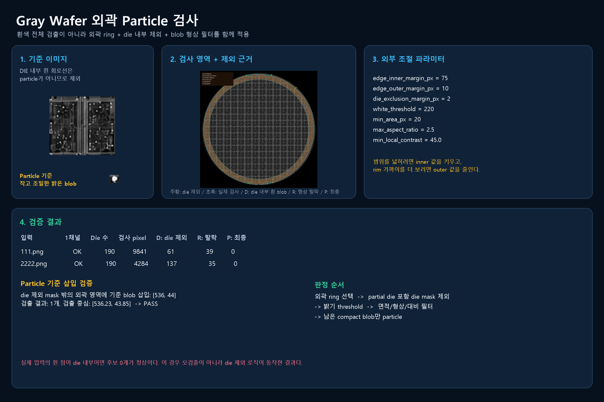
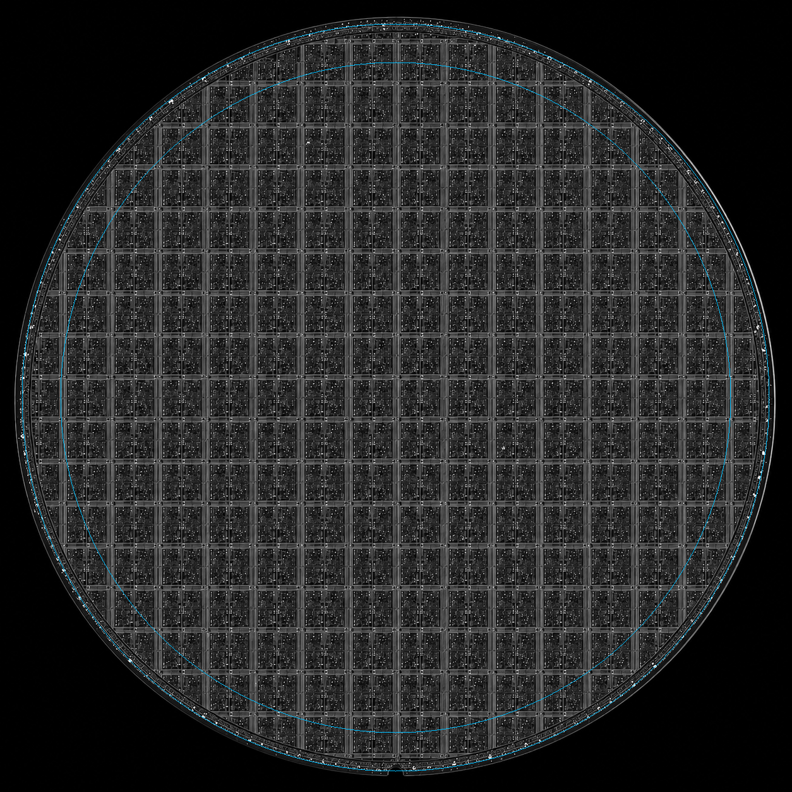
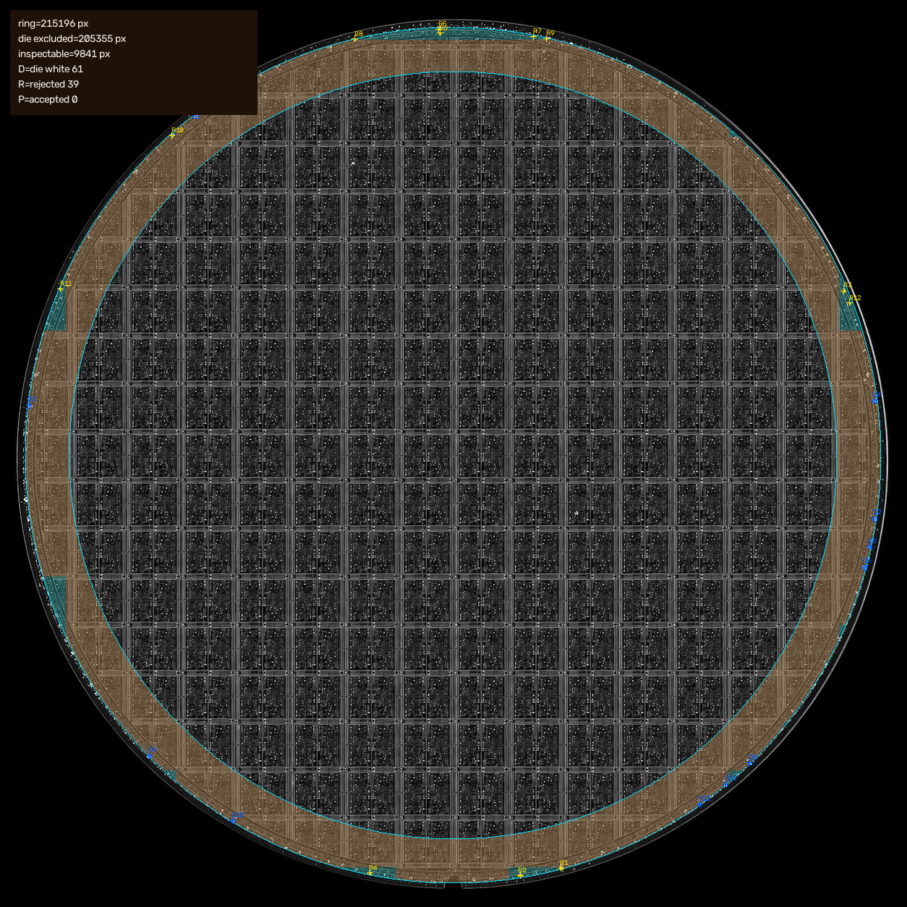
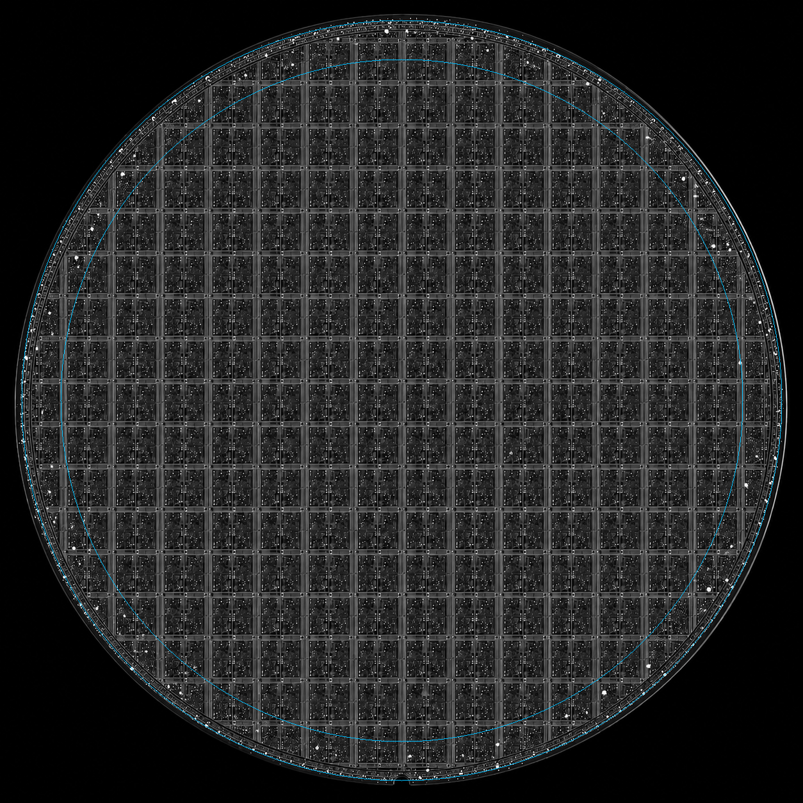
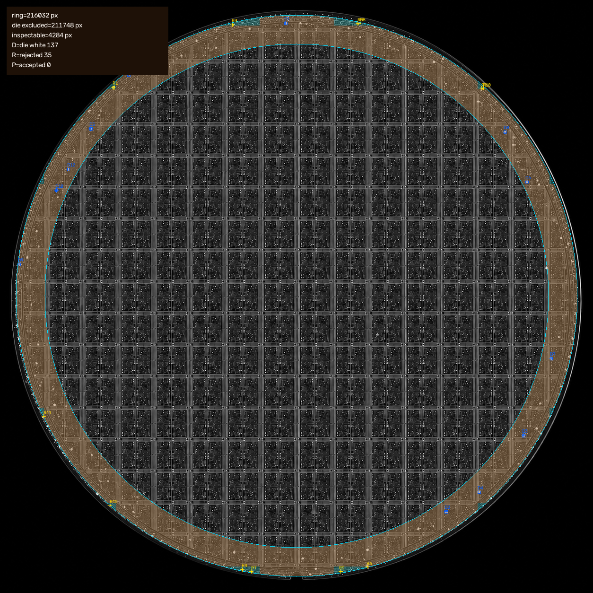

# Gray Wafer 외곽 Particle 검사



## 목적

외곽 검사 영역이 partial die와 겹치더라도 die 내부의 흰 회로선, street, 접점은 particle로 검출하지 않는다. 검사 대상은 wafer 외곽의 조절 가능한 ring 안에서 die mask 밖에 남는 작고 조밀한 밝은 blob이다.

## 호출 방식

기존 방식대로 먼저 `dm`을 만들고, particle 함수에는 `dm`을 넣는다. `dm.aligned_image`를 기준으로 검사하므로 회전 보정 뒤에도 die 좌표와 particle 좌표가 일치한다.

```python
import cv2
from use_gray_wafer_die_particle import build_die_map, inspect_edge_particles

image = cv2.imread("Gray_Wafer/2222.png", cv2.IMREAD_GRAYSCALE)
dm = build_die_map(image, grid_method="std", notch_align=False, edge_mode="both")
result = inspect_edge_particles(
    dm,
    edge_inner_margin_px=75,
    edge_outer_margin_px=10,
    ring_guard_px=2,
    die_exclusion_margin_px=2,
    white_threshold=220,
    min_area_px=20,
    max_area_px=300,
    max_aspect_ratio=2.5,
    min_fill_ratio=0.45,
    min_local_contrast=45.0,
)
particles = result["particles"]
```

## 파라미터

| 파라미터 | 기본값 | 의미 |
| --- | ---: | --- |
| `edge_inner_margin_px` | 75 | wafer edge에서 안쪽으로 검사할 폭. 키우면 더 넓은 외곽 영역을 검사한다. |
| `edge_outer_margin_px` | 10 | wafer rim에 너무 가까운 영역을 제외한다. 줄이면 rim 쪽까지 더 검사한다. |
| `ring_guard_px` | 2 | ring의 양쪽 경계에서 잘린 blob을 막는 안전 여유다. |
| `die_exclusion_margin_px` | 2 | partial die를 포함한 모든 die 내부 제외 영역의 확장값이다. |
| `white_threshold` | 220 | 후보 밝기 하한값이다. |
| `min_area_px`, `max_area_px` | 20, 300 | 너무 작은 노이즈와 큰 line 조각을 제외한다. |
| `max_aspect_ratio` | 2.5 | 길쭉한 street/line 조각을 제외한다. |
| `min_fill_ratio` | 0.45 | 빈 사각형이나 가는 line을 제외한다. |
| `min_local_contrast` | 45 | 주변보다 충분히 밝은 blob만 유지한다. |

## 로직

1. Gray 1채널 입력으로 `dm = build_die_map(image, ...)`을 만들고, `dm.aligned_image`에서 검사한다.
2. `dm.dies`가 partial die를 제외했더라도 `dm`의 float grid를 이용해 edge에 걸친 die까지 mask로 다시 만든다.
3. 두 개의 원으로 만든 외곽 ring과 die mask 밖의 교집합만 검사한다.
4. 밝기 threshold 후 연결 성분을 만들고 면적, 가로세로 비율, 채움률, 주변 대비를 적용한다.
5. 통과한 component만 `particles` 목록에 `bbox_px`, `center_px`, 면적과 대비 정보를 기록한다.

## 진단 표기

상세 overlay는 단순 결과만 보여주지 않고 흰 component가 어느 단계에서 제외됐는지 표기한다.

| 표기 | 의미 |
| --- | --- |
| 하늘색 원 | 설정한 외곽 ring의 안쪽/바깥쪽 경계 |
| 주황 음영 | ring 안이지만 partial die를 포함한 die 내부라 검사에서 제외된 영역 |
| 초록 음영 | 실제 particle 검사 가능 영역 |
| `D1`, `D2` | die 내부의 밝은 blob. 흰색이더라도 particle 후보가 아니다. |
| `R1`, `R2` | 검사 영역 안이지만 면적, 형상, 채움률, 대비 기준에서 탈락한 blob |
| `P1`, `P2` | 모든 기준을 통과한 최종 particle |

## 검증 결과

`evaluate_gray_edge_particles.py`를 실행해 새 Gray 원본 2장과 Particle 기준 삽입 검증을 수행한다.

| 입력 | 1채널 입력 | Die 수 | Pitch | 검사 pixel | 실제 particle 후보 |
| --- | --- | ---: | ---: | ---: | ---: |
| `111.png` | OK | 190 | 76 x 67 | 9,841 | 0 |
| `2222.png` | OK | 190 | 76 x 67 | 4,284 | 0 |

실제 입력의 외곽 흰 점은 partial die 내부에 위치해 제외됐다. 이는 die 내부의 흰 회로선을 particle로 오검출하지 않기 위한 의도된 동작이다.

Particle 기준 이미지 `Paticle/22.png`를 die mask 밖의 외곽 영역에 축소 삽입한 검증에서는 1개를 삽입 좌표 근처에서 검출했다.

### 111.png Overlay





### 2222.png Overlay




