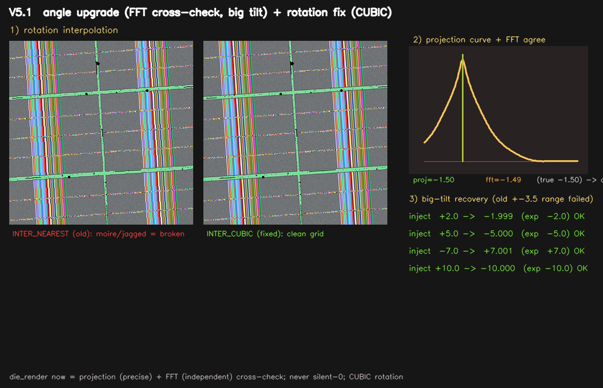

# Wafer Die Map V5

웨이퍼 이미지에서 **웨이퍼 원(Circle) 검출 → 다이 격자 검출 → 회전 보정 → 전체 다이 맵 생성(엣지 다이 포함)** 을 단일 파일로 수행하는 Python 모듈입니다.

- **의존성**: `numpy`, `opencv-python` 만 사용 (Python 3.9)
- **구조**: 단일 파일 (`wafer_die_map_v5.py`), 복사-붙여넣기로 즉시 사용 가능

---

## 폴더 구성

| 파일 | 설명 |
|------|------|
| `wafer_die_map_v5.py` | 메인 코드(단일 파일) |
| `USE_LATEST/use_manual_grid_wafer_map.py` | 수동 float grid corner/pitch 입력 전용 단일 파일. wafer 중심만 이미지에서 검출한다. |
| `USE_LATEST/use_gray_wafer_die_particle.py` | Gray wafer 및 wafer ring particle 검사 전용 단일 파일. |
| `WEAK_GRAY_CROSS_GRID_KO.md` | 1채널 3000x3000 약신호용 십자 corner/pitch 검출 규칙과 파라미터 가이드 |
| `TEST_3000_GRAY/` | TEST의 10000px 입력에서 만든 3000x3000 Gray 이미지와 cross grid 판정 overlay |
| `MANUAL_GRID_WAFER_MAP_KO.md` | 수동 grid 입력 좌표 규칙 및 호출 가이드 |
| `MANUAL_GRID_API_REFERENCE_KO.md` | 수동 grid 전용 함수, `dm`, Die entry, `locate_die` 전체 반환값 레퍼런스 |
| `evaluate_manual_grid_wafer_map.py` | 수동 float grid 입력 회귀 검사 스크립트 |
| `LOGIC_SPEC.html` | 로직 시각 설명서(브라우저로 열기) — 왜 이렇게 했나 |
| `LOGIC_SPEC.md` | 로직 텍스트 설명서 |
| `make_real_test_images.py` | Wikimedia Commons 실제 die/wafer 소스로 테스트 이미지 재생성 |
| `make_bw_noisy_test_image.py` | 3000×3000 흑백 고노이즈 웨이퍼 샘플 생성 |
| `evaluate_bw_noisy_image.py` | 흑백 고노이즈 샘플 전용 판정/검증 스크립트 |
| `make_v5_viz.py` | V5 시각화 재생성 스크립트 |
| `v5_overview.png` | die_render 격자(굵기3) 오버레이 + EDGE 2종 구분 맵 |
| `make_angle_upgrade_viz.py` | V5.1 각도 고도화 시각화 재생성 스크립트 |
| `v5_angle_upgrade.png` | V5.1 검증 이미지 (NEAREST vs CUBIC 줌 / projection+FFT 일치 / 큰 기울기 복원표) |
| `Test_Images/SOURCES.md` | 실제 소스 이미지 출처/라이선스 메모 |

> **이전 버전** (`../wafer_die_map.py`, `../wafer_die_map_v2/v3/v4`) 은 그대로 보존됩니다.

---

## 빠른 시작

```python
from wafer_die_map_v5 import build_die_map, locate_die

# 기본 사용 (die_render 각도 정렬, edge_mode="both")
dm = build_die_map("wafer.jpg")

# 각도 정렬 방식을 notch로 변경
dm = build_die_map("wafer.jpg", angle_align_method="notch")

# 안전하게 부분 die를 줄이고, 남은 외곽 20px band의 index도 사용
dm = build_die_map("wafer.jpg", edge_clip_margin_px=8,
                   edge_index_margin_px=20, edge_mode="both")
print(dm.edge_indices)
print(dm.edge_index_report["margin"])

# 정렬된 이미지 가져오기
img = dm.aligned_image

# 특정 좌표/영역의 다이 조회
r = locate_die(dm, bbox=(x1, y1, x2, y2))
print(r["die_index"])       # 다이 인덱스 (행, 열)
print(r["die_rect_px"])     # 픽셀 단위 다이 사각형
print(r["real_coord"])      # 실좌표
print(r["is_edge"])         # 엣지 여부 (edge_mode 기준)
print(r["is_edge_partial"]) # 원 밖으로 삐져나온 부분 다이 여부
print(r["is_edge_ring"])    # 최외곽 격자 링 다이 여부
print(r["is_edge_margin"])  # 지정한 edge band 안의 완전 다이 여부
```

---

## 공개 API

### `build_die_map(image, ...) -> WaferDieMap`

웨이퍼 이미지로부터 다이 맵을 생성합니다.

| 파라미터 | 기본값 | 설명 |
|----------|--------|------|
| `image` | — | 파일 경로(str) 또는 numpy 배열 |
| `angle_align_method` | `"die_render"` | 각도 정렬 방식: `"die_render"` \| `"notch"` \| `"vertical_line"` \| `"none"` |
| `edge_clip_margin_px` | `0` | 유효 wafer 원을 안쪽으로 줄이는 안전 여유(px). |
| `edge_index_margin_px` | `0` | 포함된 완전 die 중 유효 edge에서 안쪽으로 이 폭만큼을 edge로 추가 분류한다. |
| `edge_mode` | `"both"` | 엣지 정의: `"circle"` \| `"ring"` \| `"margin"` \| `"both"`. |

**반환값 `WaferDieMap` 주요 속성:**

- `aligned_image` — 회전 보정된 이미지 (항상 10000×10000, 0도여도 반환)
- `dies` — 검출된 전체 다이 목록
- `pitch` — 다이 피치(픽셀)
- `origin` — 격자 원점(픽셀)
- `angle` — 보정에 사용된 회전 각도(도)
- `angle_confidence` — 각도 측정 신뢰도 (0~1). projection+FFT 합의 시 ≈ 0.97 (**V5.1 신규**)
- `angle_agree` — projection ↔ FFT 두 단서 합의 여부. `False` 면 해당 이미지의 각도 검토 권장 (**V5.1 신규**)

### `locate_die(die_map, point=None, bbox=None) -> dict`

특정 점 또는 영역에 해당하는 다이 정보를 반환합니다.

**반환 dict 키:**

| 키 | 설명 |
|----|------|
| `die_index` | `(row, col)` 격자 인덱스 |
| `die_rect_px` | `(x1, y1, x2, y2)` 픽셀 좌표 |
| `real_coord` | 실좌표 `(x_mm, y_mm)` |
| `is_edge` | 엣지 여부 (`edge_mode` 에 따라 다름) |
| `is_edge_partial` | 웨이퍼 원 밖으로 걸친 다이 여부 |
| `is_edge_ring` | 최외곽 링(8방향 이웃 중 빠진 것 있음) 여부 |
| `is_edge_margin` | 지정한 유효 edge band 안의 완전 die 여부 |
| `edge_distance_px` | 유효 edge 원에서 die의 가장 먼 모서리까지 남은 거리(px) |
| `edge_mode` | 빌드 시 사용된 `edge_mode` 값 |

---

## V5.1 변경

V5 위에 **회전 품질**과 **각도 신뢰성**을 강화한 마이너 업데이트입니다.

| 항목 | 내용 |
|------|------|
| **(1) 회전 보간 CUBIC 변경** | `_rotate_wafer_keep_size` 보간을 `INTER_NEAREST` → `INTER_CUBIC` 으로 변경. 다이 격자의 계단/모아레 깨짐 제거. (Laplacian 분산 7397 → 5024) |
| **(2) 각도 = projection + FFT 교차검증** | 열/행 투영 분산(projection)과 2D FFT 스펙트럼 peak(FFT)를 독립 계산 후 합의. 탐색 범위 ±6°로 확장 — ±10° 이상 큰 기울기도 오차 ≤ 0.001° 복원. 격자 검출 실패 시에도 각도 측정 가능(픽셀 기반). |
| **(3) 새 필드/함수** | `angle_confidence` (0~1), `angle_agree` (bool). 새 공개 함수 `measure_wafer_angle_robust()`. |

```python
dm = build_die_map("wafer.jpg")
print(dm.angle_confidence)  # 합의 시 ≈ 0.97
print(dm.angle_agree)       # False 면 각도 검토 권장
```

시각화: 

---

## V5 주요 변경 사항 (한눈에 보기)

| 항목 | 내용 |
|------|------|
| **(A) 새 기본 각도 정렬** | `angle_align_method="die_render"` — 전체 다이 격자 렌더링 기반, 정밀도 ≤ 0.003° |
| **(B) 엣지 다이 2종 구분** | `is_edge_partial` (원 밖 걸침) + `is_edge_ring` (최외곽 격자 링) 동시 저장 |
| **(C) aligned_image 항상 반환** | 각도 0도여도 반환, 출력 크기 고정 10000×10000 |

자세한 설명은 [`LOGIC_SPEC.md`](./LOGIC_SPEC.md) 또는 [`LOGIC_SPEC.html`](./LOGIC_SPEC.html) 을 참조하세요.

---

## 정확도 (실측)

| 테스트 조건 | 각도 오차 | residual |
|-------------|-----------|---------|
| 실제 notch 이미지 (green/blue/mint) | ≤ 0.001° | 0.0000 |
| 랜덤 틸트 12장 (-3°~+3°) | 최대 0.003° | verified=True |

> 이전 방식(`notch`, `vertical_line`) 의 오차 ~0.02–0.07° 대비 대폭 향상.

---

## 환경

```
Python  >= 3.9
numpy
opencv-python
```
