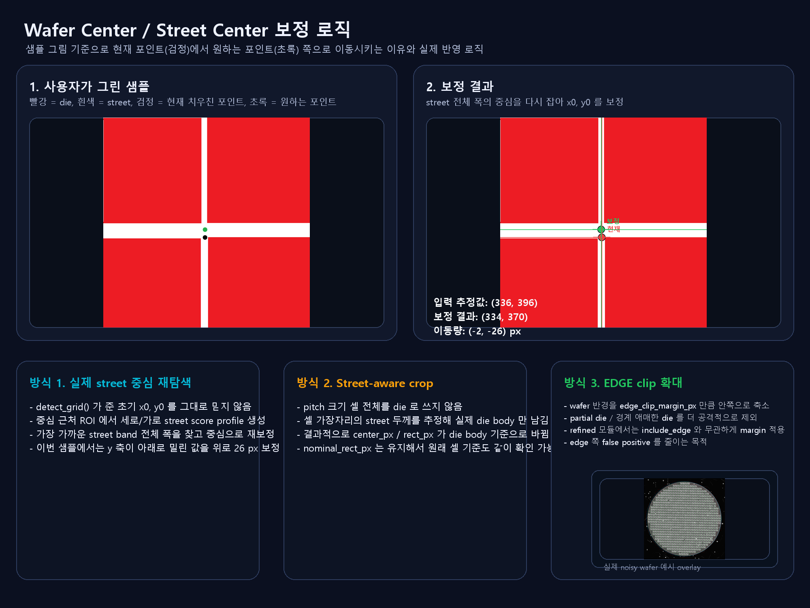

# Refined Center / Edge Clip 로직

샘플 이미지 `E:/mirero/Sample_Point.png` 기준으로 보면,

- 빨간색: `die`
- 흰색: `die 사이 street`
- 검은 점: 현재 약간 밀린 포인트
- 초록 점: 원하는 포인트

이번 보정은 `wafer_die_map_v5.py` 원본을 크게 흔들지 않고, 별도 모듈 `wafer_die_map_v5_refined.py` 에 분리해서 넣었습니다.



## 핵심 변경

### 1. 실제 street 중심을 다시 찾는 방식

`detect_grid()` 가 처음 잡은 `x0`, `y0` 를 그대로 쓰지 않습니다.

중심 근처 ROI 에서:

- 세로 방향 street score profile
- 가로 방향 street score profile

를 다시 만들고, 가장 가까운 street band 의 전체 폭을 찾은 뒤 그 중심으로 `x0`, `y0` 를 재보정합니다.

샘플 그림 기준으로는:

- 입력 추정값: `(336, 396)`
- 보정 결과: `(334, 370)`
- 이동량: `(-2, -26) px`

즉, 아래쪽으로 밀린 포인트를 초록점 방향으로 다시 끌어올리도록 바뀌었습니다.

### 2. 흰색 여백(street)을 감안해서 die body만 쓰는 방식

기존에는 pitch 크기 셀 전체를 사실상 die 로 볼 수 있었습니다.

이제는 각 셀의 가장자리에서 street 두께를 추정해서:

- `nominal_rect_px`: 원래 pitch 셀
- `rect_px`: street 를 제외한 실제 die body
- `center_px`: die body 기준 중심
- `street_trim_px`: 좌/상/우/하 잘린 양

을 함께 보관합니다.

즉, 실제 다른 파일에서 사용할 때도:

- 원래 격자 기준이 필요한 경우 `nominal_*`
- 실제 die body 기준이 필요한 경우 `rect_px`, `center_px`

로 나눠서 사용할 수 있습니다.

### 3. EDGE 영역을 더 안쪽으로 clip

`edge_clip_margin_px` 를 넣어서 wafer 유효 반경을 안쪽으로 더 줄였습니다.

이번 refined 모듈에서는 이 margin 을 실제 die 포함 반경에도 적용해서:

- edge 쪽 partial die
- 경계에 걸쳐서 애매한 die

를 더 공격적으로 제외합니다.

## 사용 방법

```python
from wafer_die_map_v5_refined import build_die_map, locate_die

dm = build_die_map(
    "wafer.png",
    include_edge=False,
    refine_grid_origin=True,
    street_aware_crop=True,
    edge_clip_margin_px=12,
)

result = locate_die(dm, point=(1500, 1500))
print(result["die_center_px"])
print(result["die_nominal_center_px"])
print(result["street_trim_px"])
print(result["grid_origin_shift_px"])
```

## 같이 추가한 파일

- `wafer_die_map_v5_refined.py`
  - 실제 보정 로직이 들어간 분리 모듈
- `evaluate_refined_center_logic.py`
  - 테스트 이미지들에 대해 보정 결과를 숫자로 출력
- `make_refined_center_visual.py`
  - 설명용 시각화 이미지 생성

