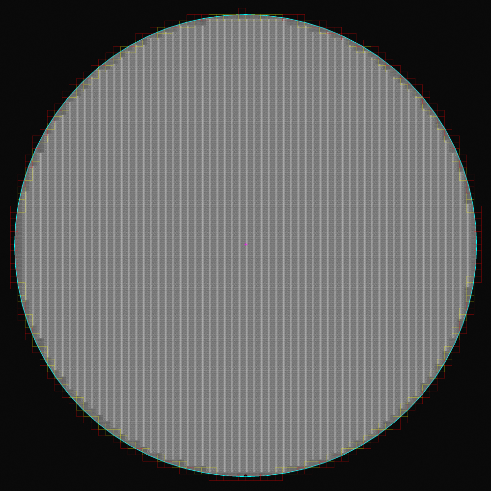

# TEST 3000x3000 Gray: 원을 통과하는 EDGE 검증

입력은 `E:\mirero\Claude_V5\원본\Claude_V5\TEST\wafer_1.jpg` 한 장만 사용했다. 10000x10000 BGR JPEG 원본은 약 52MB이므로 GitHub에는 올리지 않고, `INTER_AREA`로 축소한 3000x3000 1채널 Gray 결과와 검증 자료만 포함했다.

## 결과 파일

| 파일 | 설명 |
| --- | --- |
| `wafer_1_gray_3000.png` | 3000x3000 1채널 Gray 입력 |
| `wafer_1_cross_overlay_3000.png` | 전체 Die map. 일반 Die는 초록색, 실제 EDGE는 빨간색 |
| `wafer_1_edge_gap_diagnostic_3000.png` | EDGE 누락 원인을 확인하는 진단 이미지 |
| `*_preview.png` | GitHub에서 빠르게 보는 1000px 미리보기 |
| `generate_edge_crossing_validation.py` | 위 결과를 원본 TEST JPEG에서 다시 생성하는 스크립트 |
| `validate_edge_circle_geometry.py` | 원-사각형 EDGE 교차 회귀 테스트 |

## 적용 설정

```python
dm = build_die_map(
    gray_3000,
    grid_method="cross",
    min_pitch=30,
    max_pitch=70,
    notch_align=False,
    clip_partial_edge=False,
    edge_clip_margin_px=0,
    edge_mode="circle",
)
```

## 측정 결과

| 항목 | 결과 |
| --- | --- |
| wafer center | `(1500, 1500)` px |
| wafer radius | `1412` px |
| `pitch_x`, `pitch_y` | `44.979`, `39.000` px |
| corner `(x0, y0)` | `(1502, 1492)` px |
| partial Die 포함 map Die 수 | `3711` |
| 실제 원-사각형 교차 EDGE | `271` |
| 기존 중심점 방식이 찾은 EDGE | `124` |
| 기존 방식 누락 EDGE | `147` |




## 수정한 판정 로직

기존 방식은 Die **중심점이 원 안에 있는지** 먼저 검사했다. 그래서 사각형 일부는 wafer 안에 있지만 중심점이 원 밖인 EDGE Die가 후보에서 제외됐다.

현재 방식은 다음 순서로 판단한다.

1. 사각형과 wafer 원판이 겹치는 모든 Die를 map 후보로 남긴다.
2. 원 둘레가 사각형의 네 변 중 하나를 통과하면 `is_edge_partial=True`로 표시한다.
3. `clip_partial_edge=True`이면 이 실제 EDGE Die를 map에서 제거하고, `False`이면 map에 남긴다.

진단 이미지의 색상은 다음과 같다.

| 색상 | 의미 |
| --- | --- |
| 하늘색 | wafer circle |
| 노란색 | 기존 중심점 방식도 찾은 EDGE |
| 빨간색 | 기존 방식이 누락한 실제 EDGE. 중심은 원 밖이지만 box는 원을 통과함 |
| 자홍색 십자 | 선택된 grid corner |

따라서 `edge_mode="circle"`에서 반환되는 `dm.edge_indices`와 각 Die의 `is_edge_partial`은 원을 실제로 통과하는 모든 box의 인덱스다. `edge_mode="ring"`은 이 정의와 다르며, 단순히 현재 map에서 이웃 Die가 비어 있는 가장자리 줄을 의미한다.
