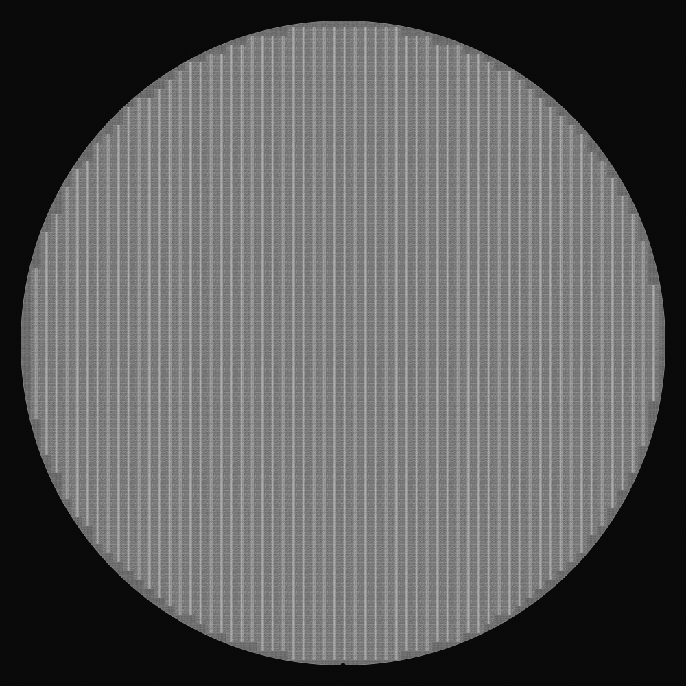
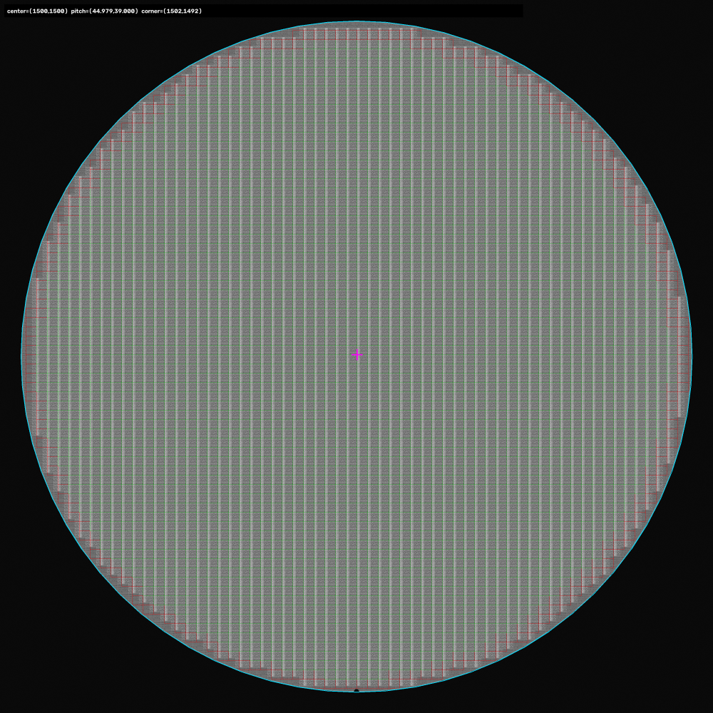

# TEST 3000x3000 Gray 변환 및 Cross Grid 결과

입력은 `E:\mirero\Claude_V5\원본\Claude_V5\TEST\wafer_1.jpg` 한 장만 사용했다. 원본 JPEG는 약 52MB이므로 GitHub에는 올리지 않고, `INTER_AREA` 방식으로 만든 3000x3000 1채널 Gray 결과만 포함한다.

## 포함 파일

| 파일 | 설명 |
| --- | --- |
| `wafer_1_gray_3000.png` | 3000x3000 1채널 Gray 테스트 이미지 |
| `wafer_1_cross_overlay_3000.png` | 검출된 grid/edge/wafer circle/corner overlay |
| `wafer_1_gray_preview.png` | GitHub에서 빠르게 확인할 수 있는 1000px Gray 미리보기 |
| `wafer_1_cross_overlay_preview.png` | 1000px overlay 미리보기 |

## 적용 파라미터

```python
dm = build_die_map(
    gray_3000,
    grid_method="cross",
    min_pitch=30,
    max_pitch=70,
    notch_align=False,
)
```

## 판정 결과

| 항목 | 결과 |
| --- | --- |
| 입력 | 10000x10000 BGR JPEG -> 3000x3000 Gray PNG |
| wafer center | `(1500, 1500)` px |
| wafer radius | `1412` px |
| `pitch_x` | `44.979` px |
| `pitch_y` | `39.000` px |
| corner `(x0, y0)` | `(1502, 1492)` px |
| 포함 Die 수 | `3419` |
| 현재 edge Die 수 | `262` |





초록색은 일반 Die, 빨간색은 현재 edge 기준 Die, 하늘색은 wafer circle, 자홍색 십자는 선택한 central grid corner다.
